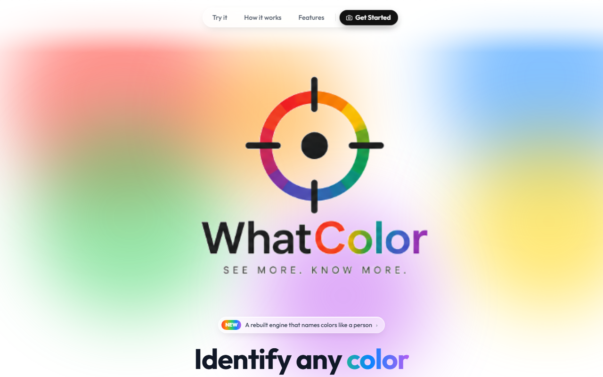

# WhatColor

> A color identification tool built for the colorblind. Point your camera at anything and instantly know what color it is.

[](https://what-color.com)


[](LICENSE)



I built WhatColor because naming a color should take a phone camera and one second, not a 4-step app workflow. Open the site, point, read the name. That's it.

No app install. No login. Just open it.

## Two ways to use it

- **Live camera:** aim the crosshair at anything and the color name and hex update in real time
- **Upload an image:** drop in a photo and tap anywhere on it to identify that color

## How it works

- **Real-time camera sampling** at 60fps through the browser's MediaStream API
- **Crosshair-targeted detection:** only the small center region gets sampled
- **Median sampling** over that region to reject single-pixel noise
- **Adaptive EMA smoothing** (α=0.85) so the name doesn't flicker between shades
- **Luminance-aware naming** that suppresses hue names at extreme dark or light values, where they'd be wrong
- **SVG crosshair overlay** that stays sharp at any resolution

## Built with

- **React + Vite**, React Router
- **Tailwind CSS**
- Browser **MediaStream API** and Canvas
- **Vitest** for tests
- Deployed on **Vercel**

## Run locally

```bash
git clone https://github.com/Hixly/whatcolor.git
cd whatcolor
npm install
npm run dev
```

Open the dev URL on your phone (same Wi-Fi network) to test with a real camera. Run the tests with `npm test`.

## License

[MIT](LICENSE)
