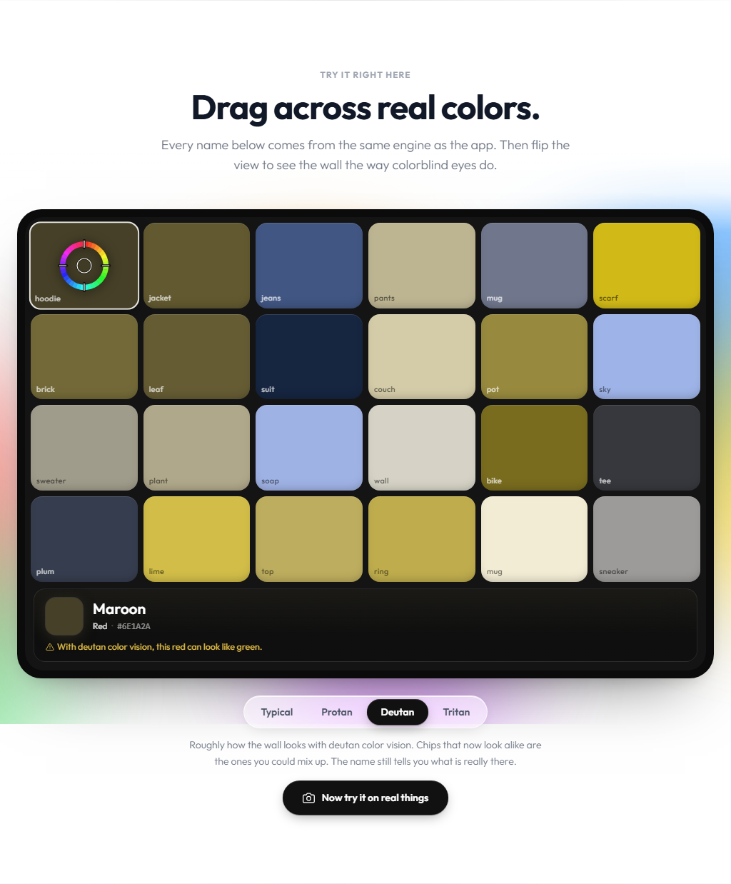

# WhatColor

> Identify any color in words you actually use. Point your camera and WhatColor says what a friend would: navy, olive, dusty rose.

[](https://what-color.com)


[](LICENSE)


I'm colorblind, the strong red-green kind. WhatColor is the tool I wanted in my pocket: open it, point, and know the color. No app store, no login, and nothing leaves your phone.

## What you get

- **Live camera:** aim the reticle and the name locks in as you hold steady. The circle in the middle is exactly what gets read.
- **Photos:** tap or drag across any picture.
- **Everyday names in 12 families:** "Maroon, red family, deep red, like dried cherries."
- **Heads-ups for your eyes:** set protan, deutan, or tritan and it warns you when a color can pass for another, based on a simulation of that type.
- **Compare two colors:** match or not, CIEDE2000 difference, "would these look the same to me?", and WCAG contrast.
- **Set white:** one tap on white paper corrects for warm bulbs and shade.
- **Read aloud, save, export** (PNG sheet or JSON), and **install** it to your home screen. Works offline once loaded.

## The color engine



The first version matched colors to a web developer's list in raw RGB. It called a maroon hoodie "Taupe" and khaki pants "Sage." The engine in [`src/engine`](src/engine) was rebuilt from scratch:

- **Perceptual math.** Colors are compared in OKLab, where distance tracks what eyes see, not raw RGB or HSL.
- **155 everyday names** grouped into 12 basic families, with values anchored to how people actually use the words.
- **Plain descriptions** judged per hue ("Light, soft orange", "Deep red", "Medium gray with a blue tint"), so "vivid" means the same thing for yellow as for blue.
- **Honest edges.** When a color sits between two names, it tells you what else people would call it.
- **Color-vision simulation** (Machado et al. 2009, in linear light) drives the warnings and the compare screen.
- **Robust camera reading.** The spot is averaged in linear light with glare and shadow pixels trimmed, smoothed in OKLab, and names are sticky so they don't flicker.

### Benchmark

Scored against the [XKCD color survey](https://blog.xkcd.com/2010/05/03/color-survey-results/) (CC0), where over 200,000 people named colors in their own words: 784 colors whose names contain a color word.

| | Same family as the name's main word | Family matches any color word in the name |
|---|---|---|
| Old engine | 66.6% | 76.3% |
| **New engine** | **84.7%** | **93.9%** |

Reproduce it with `npx vitest run src/engine/__tests__/xkcdBenchmark.test.js --reporter=verbose`.

## Built with

- **React 19 + Vite**, React Router
- **Tailwind CSS**
- Browser **MediaStream API** and Canvas; a small service worker for offline use
- **Vitest** for tests
- Deployed on **Vercel**

## Run locally

```bash
git clone https://github.com/Hixly/whatcolor.git
cd whatcolor
npm install
npm run dev
```

Open the dev URL on your phone (same Wi-Fi network) to test with a real camera. Run the tests with `npm test` and lint with `npm run lint`.

## License

[MIT](LICENSE)
